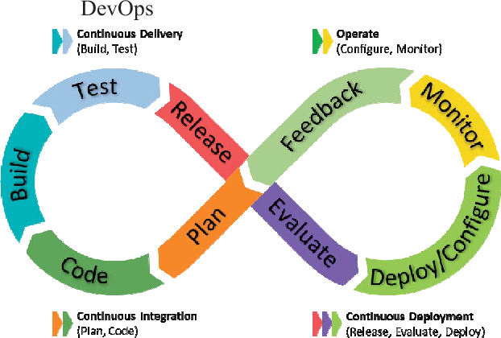

# QUEX Quantum DevOps

## QEX

QEX (Quantum Excellence Centre) is a European Quantum Centre of Excellence funded by the EuroHPC Joint Undertaking, bringing together leading research institutions and national ecosystems across Europe to accelerate quantum‑computing research and its translation into industrial applications. QEX is anchored at the University of Southern Denmark’s Center for Quantum Mathematics, providing a one‑stop hub where scientists, engineers, companies and policymakers can collaborate, share tools and develop quantum‑enhanced solutions for sectors such as finance, pharma and climate modelling. Its mission is to strengthen Europe’s leadership in quantum technologies by offering shared expertise, training programmes and access to high‑performance quantum resources, effectively connecting Europe for quantum excellence.

## What is DevOps?
A cultural and professional movement that merges software development (Dev) and IT operations (Ops) to deliver software faster, more reliably, and with continuous feedback.

## Core Principles
| Principle | Brief Description |
|-----------|-------------------|
| **Collaboration** | Developers, ops, QA and security work together from the start. |
| **Automation** | Build, test, deployment, and monitoring are automated to reduce manual errors. |
| **Continuous Integration (CI)** | Code changes are merged frequently and automatically tested. |
| **Continuous Delivery (CD)** | Every change can be released to production through a repeatable pipeline. |
| **Infrastructure as Code (IaC)** | Infrastructure is defined in version‑controlled code. |
| **Monitoring & Feedback** | Real‑time metrics from production guide future development. |

## Key Benefits
- **Faster time‑to‑market** – Shorter release cycles.  
- **Higher quality** – Automated testing catches bugs early.  
- **Improved reliability** – IaC and automated rollbacks reduce downtime.  
- **Cost efficiency** – Less manual effort and fewer production incidents.

## Typical Toolchain (examples)
- **Source control:** Git, GitHub, GitLab  
- **CI/CD pipelines:** Jenkins, GitHub Actions, GitLab CI, CircleCI  
- **Containers:** Docker, Kubernetes  
- **IaC:** Terraform, Ansible, CloudFormation  
- **Monitoring:** Prometheus, Grafana, ELK stack  

## Simple Adoption Steps
1. Map current workflow and identify bottlenecks.  
2. Form cross‑functional teams.  
3. Store all code and configuration in version control.  
4. Set up an automated CI pipeline with unit tests.  
5. Extend to CD: automated staging deployment, manual approval for production.  
6. Introduce IaC for reproducible environments.  
7. Add monitoring and iterate based on feedback.

